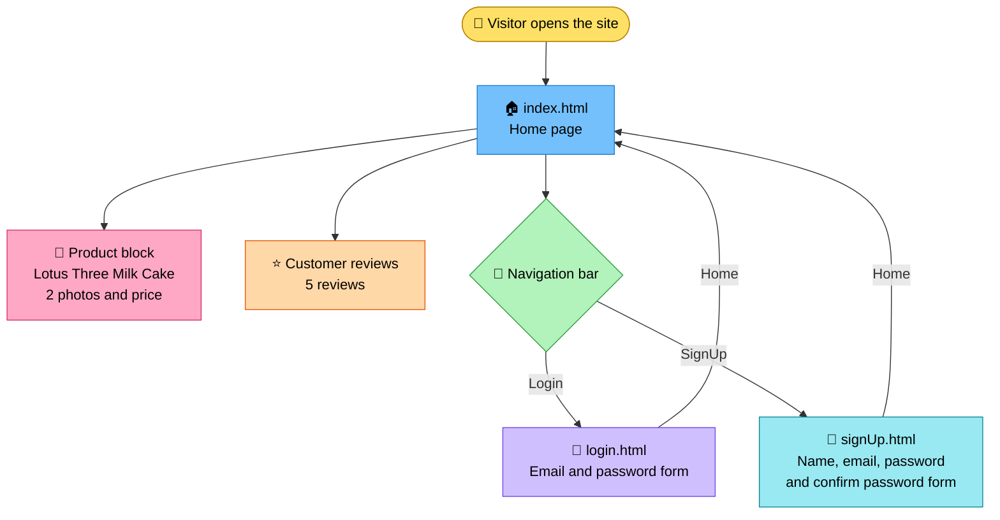
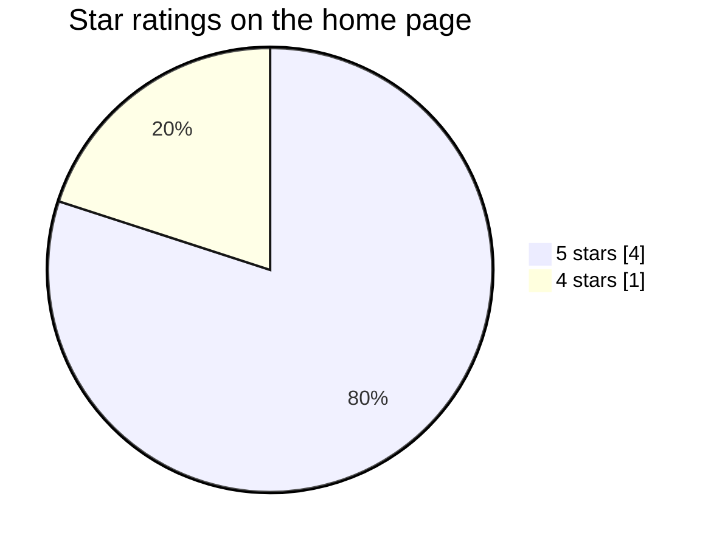
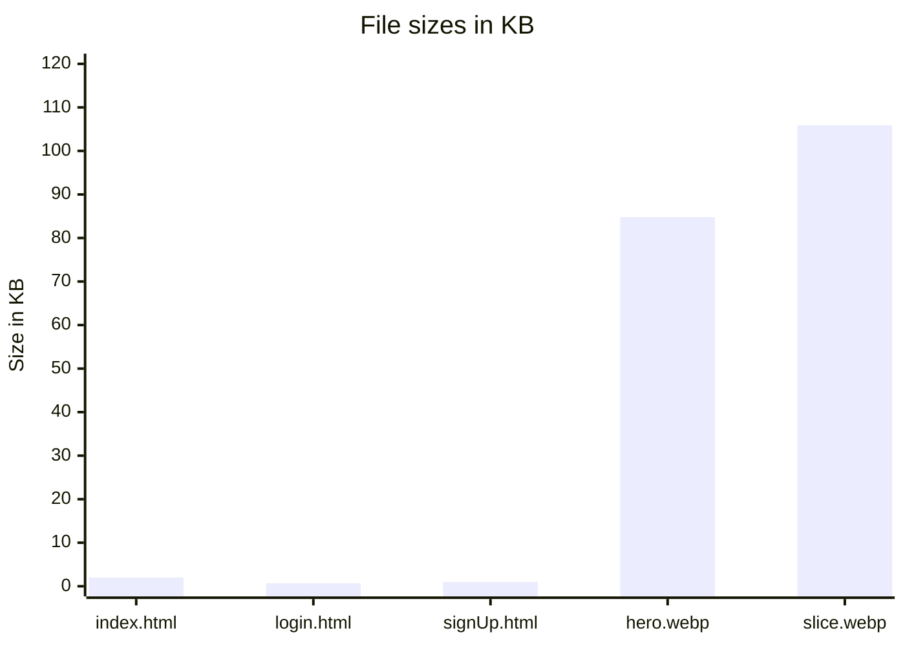

<div align="center">

# 🍰 ButtterCloud Product Website

**A simple three page website for one product: the Lotus Three Milk Cake.**


[](https://product-butttercloud.netlify.app/)

</div>

---

## 📌 At a Glance

| | |
|---|---|
| 🏷️ **Project** | ButtterCloud product website |
| 🍰 **Product featured** | Lotus Three Milk Cake (Rs. 2,999) |
| 🧱 **Built with** | HTML only |
| 📄 **Pages** | 3 (Home, Login, SignUp) |
| 🎓 **Made for** | Web Development course at Talha's School, Project 2 |
| 🌐 **Live site** | https://product-butttercloud.netlify.app/ |

---

## 🗣️ In Simple Words

Think of this project as the shop window for one cake.

When you open the website, you see the name of the shop, a short line about the cake, two photos of it, the price, and what five customers said about it. At the top there are three links: Home, Login and SignUp. Login and SignUp each open a page with a small form where you would type your email and password (and your name too, when signing up).

The course task was to build a website for any product using only HTML. HTML is like the skeleton of a page. It decides what goes where, but it does not decide how things look. That is why the site is plain right now, a bit like a house that has walls and doors but has not been painted yet. It does its job of showing everything clearly, and it is a solid base to add colors and design on top of later.

---

## 🔧 Technical Explanation

This is a static, multi page website written in plain HTML5. There is no CSS, no JavaScript and no backend, so every page is just a document that the browser reads and shows.

**How it is put together**

- Each page has the same navigation bar at the top, built with three anchor tags that link to `index.html`, `login.html` and `signUp.html` using relative paths.
- The home page is split into blocks with `div` elements: the navigation bar, the product block, the reviews block, and a copyright line at the bottom.
- The product block uses an `h2` for the name, a `p` for the description and price, and two `img` tags for the photos. Both photos are `.webp` files with `alt` text and fixed `width` and `height` values, so the page does not jump around while images load.
- The reviews block lists five customer reviews, each with a star rating in an `h3` and the comment in a `p`.
- The Login page has an email input and a password input. The SignUp page has name, email, password and confirm password inputs. They use the right input types (`email`, `password`, `text`) and have placeholder text.
- The site is hosted on Netlify, which serves the files exactly as they are.

**Worth knowing:** the forms are not wrapped in a `form` tag and there is no script attached to the buttons, so the Login and SignUp buttons do not send or check anything yet. The pages show what the forms would look like.

### 🗺️ Workflow Diagram



---

## 📄 Pages

| Page | File | What you will find |
|---|---|---|
| 🏠 Home | `index.html` | Product name, description, two photos, price and customer reviews |
| 🔐 Login | `login.html` | Email and password fields with a Login button |
| 📝 SignUp | `signUp.html` | Name, email, password and confirm password fields with a SignUp button |

## 🍰 The Product

| Detail | Info |
|---|---|
| Name | Lotus Three Milk Cake |
| Description | Three milks deep, Lotus crunch on top |
| Price | Rs. 2,999 |
| Photos | 2 (a full cake photo and a slice photo) |

## ⭐ Customer Reviews

| Customer | Rating | What they said |
|---|---|---|
| Ayesha | ★★★★★ | Super soft and creamy, with a delicious Lotus topping |
| Sara | ★★★★★ | Balanced sweetness and an amazing Lotus flavor |
| Hira | ★★★★☆ | Moist and delicious, loved the crunchy Lotus crumbs |
| Zainab | ★★★★★ | Fresh, soft and full of flavor, would order again |
| Ahmed | ★★★★★ | Very moist, and the Lotus spread made it even better |

Average rating: **4.8 out of 5**

---

## 📊 Graphs

### Ratings given by customers



### Size of each file in the repository



The three HTML pages together are only about 3.7 KB. Almost all of the weight comes from the two cake photos.

---

## 📦 Requirements

| Need | Details |
|---|---|
| 🌐 A web browser | Chrome, Edge, Firefox, Safari or any modern browser |
| 📥 Git | Only if you want to clone the project (you can also download it as a ZIP) |
| ✏️ A code editor | Optional, only if you want to edit the files |

Nothing else to install. There is no build step and no packages.

## 🚀 How to Run It

**The easy way:** open the [live website](https://product-butttercloud.netlify.app/).

**On your own computer:**

```bash
git clone https://github.com/nashrah692/web-dev-project2-ProductWebsite.git
cd web-dev-project2-ProductWebsite
```

Then double click `index.html` and it opens in your browser.

## 📁 Project Structure

```
web-dev-project2-ProductWebsite
├── index.html                       Home page
├── login.html                       Login page
├── signUp.html                      SignUp page
├── lotus-three-milk-cake-hero.webp  Main cake photo
└── lotus-three-milk-cake-slice.webp Cake slice photo
```

## 🧰 Built With

| Tool | Used for |
|---|---|
| HTML5 | All the pages and their content |
| WebP images | The two product photos |
| Netlify | Hosting the live site |
| GitHub | Storing the code |

## 🌱 What Is Not There Yet

- Styling with CSS (colors, spacing, fonts)
- Working Login and SignUp forms
- More products and a cart

---

## 👩‍💻 Author

Built by **Nashrah Ahmed Khan** as Project 2 of the Web Development course at Talha's School.

GitHub: [@nashrah692](https://github.com/nashrah692)

<div align="center">

© ButtterCloud 2026

</div>
